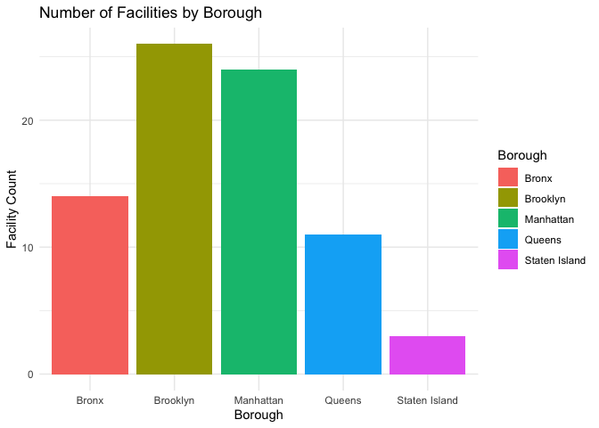

projectdraft
================
2024-11-18

# Lisa: ADD Health Data

# Nasiha: Hospital Data

``` r
hospital_data =
  read_csv(file = "./data/Hospitals.csv")
```

    ## Rows: 78 Columns: 6
    ## ── Column specification ────────────────────────────────────────────────────────
    ## Delimiter: ","
    ## chr (6): Facility Type, Borough, Facility Name, Cross Streets, Phone, Locati...
    ## 
    ## ℹ Use `spec()` to retrieve the full column specification for this data.
    ## ℹ Specify the column types or set `show_col_types = FALSE` to quiet this message.

``` r
facilities_by_borough = 
  hospital_data %>%
  group_by(Borough) %>%
  summarise(Facility_Count = n())

hospitals_by_type = 
  hospital_data %>% 
  group_by(`Facility Type`) %>% 
  summarise(Facility_Count = n())

facility_type_by_borough =
  hospital_data %>%
  group_by(Borough, `Facility Type`) %>%
  summarise(Facility_Count = n(), .groups = "drop") %>%
  pivot_wider(names_from = `Facility Type`, values_from = Facility_Count, values_fill = 0)

ggplot(data = facilities_by_borough, aes(x = Borough, y = Facility_Count, fill = Borough)) +
  geom_bar(stat = "identity") +
  theme_minimal() +
  labs(title = "Number of Facilities by Borough", x = "Borough", y = "Facility Count")
```

<!-- -->

# Yucheng: Shelter Data
